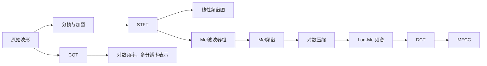

# 音频特征表示：从听觉感知到机器可计算的声音表征

> 课程位置：心理声学基础之后，音频智能与机器听觉之前  
> 建议时长：约 30 分钟  
> 关键词：STFT、Spectrogram、Mel 频谱、Log-Mel、MFCC、CQT、时频分辨率、感知尺度

---

## 一、课程目标

完成本节后，学生应能够：

1. 解释为什么音频算法通常不直接处理长时域波形，而要先构造特征表示；
2. 理解短时傅里叶变换与频谱图的基本思想，以及窗长带来的时频分辨率权衡；
3. 说明 Mel 频谱、Log-Mel 频谱和 MFCC 的计算流程及其感知依据；
4. 解释 CQT 与普通 STFT 频谱图在频率轴和分辨率上的差异；
5. 根据语音、音乐、环境声音等任务，选择合适的音频特征；
6. 认识传统人工特征与现代深度学习表征之间的关系。

---

## 二、建议授课节奏

| 时间 | 内容 |
|---|---|
| 0–3 分钟 | 为什么需要“音频特征表示” |
| 3–8 分钟 | 从波形到 STFT 与频谱图 |
| 8–15 分钟 | Mel 频谱与 Log-Mel 频谱 |
| 15–21 分钟 | MFCC：从频谱包络到倒谱系数 |
| 21–26 分钟 | CQT：面向音乐音高结构的时频表示 |
| 26–29 分钟 | 特征比较、任务选择与常见误区 |
| 29–30 分钟 | 总结与衔接下一节 |

---

# 第一部分：为什么需要音频特征表示

## 1. 从“人听声音”到“机器处理声音”

前面的心理声学课程讨论了人如何感知响度、音高、音色和空间位置。机器听觉面对的是同一个声学世界，但机器首先获得的通常只是一串随时间变化的采样值：

\[
x[n],\quad n=0,1,2,\ldots,N-1
\]

时域波形忠实记录了声压随时间的变化，但它并不直接告诉机器：

- 哪些频率成分在何时出现；
- 声音的谱包络是什么；
- 基频和谐波如何分布；
- 哪些变化与人的听觉感知更相关；
- 哪些信息对于语音识别、音乐分析或声音分类最有区分度。

因此，音频特征表示的核心任务可以概括为：

> 将原始波形转换成一种更紧凑、更稳定、更有结构，并且更适合后续算法处理的表示。

---

## 2. 好的特征通常希望保留什么

音频特征并不是信息越多越好，而是要尽量保留“与任务有关的信息”，同时减少“与任务无关的变化”。

例如：

- 语音识别希望突出语音的频谱包络和音素差异，同时尽量降低整体音量变化的影响；
- 音乐音高分析希望突出倍频程、半音和谐波关系；
- 环境声分类希望保留较完整的时频纹理；
- 说话人识别既关心声道特征，也关心基频、韵律和长期统计特征；
- 空间音频任务还需要保留双耳间时间差、声级差和空间滤波特征。

因此，没有一种特征适合所有任务。

---

# 第二部分：从波形到频谱图

## 3. 为什么不能只做一次傅里叶变换

对整段信号做离散傅里叶变换，可以得到整段声音包含哪些频率：

\[
X[k]=\sum_{n=0}^{N-1}x[n]e^{-j2\pi kn/N}
\]

但普通傅里叶变换丢失了频率成分出现的时间位置。

例如，一段声音先出现低音，后出现高音；另一段声音先出现高音，后出现低音。两者的整体幅度谱可能很接近，但听觉感受和语义完全不同。

声音通常是非平稳信号，因此需要回答两个问题：

1. 某个时间附近有哪些频率？
2. 某个频率随时间怎样变化？

---

## 4. 短时傅里叶变换 STFT

STFT 的基本思想是：

> 将长音频切分成一系列短帧，假设每一帧内部近似平稳，再分别进行傅里叶变换。

\[
X(m,k)=\sum_n x[n]w[n-mH]e^{-j2\pi kn/N}
\]

其中：

- \(m\)：时间帧索引；
- \(k\)：频率索引；
- \(w[n]\)：窗函数；
- \(H\)：帧移或 hop size；
- \(N\)：FFT 点数。

将每一帧的幅度谱沿时间排列，就得到频谱图：

\[
S(m,k)=|X(m,k)|^2
\]

频谱图的两个坐标轴分别是：

- 横轴：时间；
- 纵轴：频率；
- 颜色或亮度：幅度、功率或分贝值。

---

## 5. 窗长与时频分辨率

STFT 中最重要的概念之一是时频分辨率权衡。

### 短窗

- 时间定位更准确；
- 能分辨快速瞬态；
- 频率分辨率较低；
- 适合鼓点、爆破音、点击声等短时事件。

### 长窗

- 频率分辨率更高；
- 更容易区分相邻谐波；
- 时间变化被平均；
- 适合稳定元音、持续乐音和精细频率分析。

近似地：

\[
\Delta f \approx \frac{f_s}{N}
\]

窗越长，FFT 点数通常越大，频率间隔越小；但时间定位能力随之下降。

### 课堂提醒

不要把“FFT 点数更大”等同于“真实频率分辨率一定更高”。  
对短窗做大量零填充，只会让频谱曲线看起来更平滑，并不会增加原始信号中的真实信息。

---

# 第三部分：Mel 频谱与 Log-Mel 频谱

## 6. 为什么要改变频率轴

普通 STFT 的频率轴是线性的。例如，每个频点之间都相差固定的 Hz。

但人的音高感知并不是线性的：

- 在低频区域，人耳能够感知较细的频率差异；
- 在高频区域，相同的绝对频率差通常没有同样明显的听觉差异；
- 人对频率的感知更接近比例关系，而不是固定 Hz 差值。

Mel 尺度试图将物理频率映射到更接近主观音高距离的感知尺度。

常见换算公式为：

\[
m=2595\log_{10}\left(1+\frac{f}{700}\right)
\]

等价的自然对数形式为：

\[
m=1127\ln\left(1+\frac{f}{700}\right)
\]

需要强调：Mel 尺度不是“人耳频率响应曲线”，也不是等响曲线。  
它主要描述的是频率间隔与主观音高距离之间的近似关系。

---

## 7. Mel 滤波器组

Mel 频谱不是直接对频率轴做简单拉伸，而是对 STFT 功率谱施加一组三角形滤波器。

计算流程：

\[
\text{波形}
\rightarrow
\text{分帧加窗}
\rightarrow
\text{STFT}
\rightarrow
\text{功率谱}
\rightarrow
\text{Mel 滤波器组}
\rightarrow
\text{Mel 频谱}
\]

第 \(r\) 个 Mel 滤波器输出可以写成：

\[
E_r(m)=\sum_k S(m,k)H_r(k)
\]

其中 \(H_r(k)\) 是第 \(r\) 个三角滤波器。

滤波器组通常具有以下特点：

- 低频处较密；
- 高频处较疏；
- 相邻滤波器有重叠；
- 输出维数远低于原始 FFT 频点数。

例如，原始单帧功率谱可能有 513 个频点，而 Mel 频谱常用 40、64、80 或 128 个频带。

---

## 8. 为什么常用 Log-Mel

人对声强的感知具有明显的压缩性。物理能量增加一倍，并不意味着主观响度也增加一倍。

因此，常对 Mel 能量取对数：

\[
L_r(m)=\log(E_r(m)+\epsilon)
\]

或者转换为分贝：

\[
L_r(m)=10\log_{10}\left(\frac{E_r(m)}{E_{\text{ref}}}\right)
\]

这样得到的就是 Log-Mel 频谱。

对数压缩带来三个主要作用：

1. 压缩动态范围，避免强能量成分完全主导表示；
2. 更接近听觉系统对强度的非线性感知；
3. 将频谱中的乘性变化部分转化为近似加性变化，便于统计建模。

---

## 9. Log-Mel 为什么成为深度学习常用输入

Log-Mel 频谱保留了较完整的二维时频结构：

- 横向纹理反映时间变化；
- 纵向结构反映频率分布；
- 谐波、共振峰、瞬态、噪声带都可以在图像中呈现。

因此，它很适合卷积网络、Transformer 和音频预训练模型。

常见应用包括：

- 自动语音识别；
- 声音事件检测；
- 音频分类；
- 语音情感识别；
- 音乐标签与乐器识别；
- 声学场景分类。

### 一个重要认识

Log-Mel 并不是“比原始频谱更准确”，而是通过感知压缩和降维，形成了更适合许多任务的归纳偏置。

---

# 第四部分：MFCC

## 10. MFCC 在解决什么问题

Mel 频谱仍然保留了每个 Mel 频带的局部能量。相邻频带之间通常高度相关。

MFCC 的目标是进一步提取较平滑的频谱包络，并减少特征维度和相关性。

MFCC 全称为：

> Mel-Frequency Cepstral Coefficients  
> 梅尔频率倒谱系数

典型流程：

\[
\text{波形}
\rightarrow
\text{STFT 功率谱}
\rightarrow
\text{Mel 滤波器组}
\rightarrow
\log
\rightarrow
\text{DCT}
\rightarrow
\text{MFCC}
\]

---

## 11. DCT 的作用

对 Log-Mel 频谱沿频带方向进行离散余弦变换：

\[
c_p(m)=\sum_{r=0}^{R-1}
L_r(m)
\cos\left[
\frac{\pi p}{R}
\left(r+\frac{1}{2}\right)
\right]
\]

其中：

- \(R\)：Mel 滤波器数量；
- \(p\)：倒谱系数编号；
- \(c_p(m)\)：第 \(p\) 个 MFCC。

DCT 将频谱表示从“Mel 频带坐标”转换到“频谱变化速度坐标”。

直观理解：

- 低阶系数描述频谱整体形状和缓慢变化；
- 高阶系数描述频谱中的细小起伏；
- 语音识别常保留前 12、13、20 或 40 个系数；
- 过高阶系数往往更容易受到噪声和局部谱细节影响。

---

## 12. MFCC 与语音产生机制

语音可以粗略理解为：

\[
\text{语音}=\text{声源激励}\times\text{声道滤波}
\]

在频域中，声源谱与声道传递函数相乘；取对数后变为相加。倒谱分析可以在一定程度上将快速变化的谐波结构与缓慢变化的声道谱包络分离。

MFCC 主要保留频谱包络，因此特别适合描述：

- 元音共振峰结构；
- 音素间的声道差异；
- 说话人的声道特征。

但它会弱化：

- 精细谐波结构；
- 明确的绝对音高信息；
- 一部分瞬态和局部时频纹理。

---

## 13. 一阶差分与二阶差分

传统语音系统中，MFCC 常与动态特征组合：

\[
\Delta c_t
\]

表示 MFCC 随时间的一阶变化速度；

\[
\Delta^2 c_t
\]

表示二阶变化或加速度。

常见组合为：

\[
[\text{MFCC},\Delta\text{MFCC},\Delta^2\text{MFCC}]
\]

这种设计反映了一个重要事实：

> 语音信息不仅存在于单帧频谱中，也存在于频谱随时间的运动轨迹中。

现代深度网络能够通过上下文建模自动学习动态关系，因此不一定必须显式加入差分特征。

---

## 14. MFCC 的优势与局限

### 优势

- 特征维度低；
- 对整体幅度变化相对稳健；
- 能较好描述语音谱包络；
- 适合传统 GMM、HMM、SVM 等统计模型；
- 计算量低，易于实时部署。

### 局限

- DCT 压缩会损失二维时频局部结构；
- 对音乐中的音高与谐波关系表达不足；
- 低阶系数容易混入整体能量信息；
- 对参数设置、噪声和录音条件仍然敏感；
- 在许多现代深度学习任务中，Log-Mel 往往比低维 MFCC 提供更多可学习信息。

---

# 第五部分：CQT

## 15. 为什么音乐分析需要另一种频率表示

STFT 的每个频率 bin 都具有相同的 Hz 间隔：

\[
f_k=k\frac{f_s}{N}
\]

这对于物理频率分析很自然，但音乐中的音高系统是按频率比例组织的。

十二平均律中，相邻半音的频率比为：

\[
2^{1/12}
\]

相差一个八度的两个音，其频率比为 2，而不是相差固定的 Hz。

因此，在音乐音高、和弦与旋律分析中，希望频率轴按照对数比例排列。

---

## 16. CQT 的基本思想

CQT 全称为 Constant-Q Transform，即常数 Q 变换。

其中心频率通常按几何级数排列：

\[
f_k=f_{\min}2^{k/B}
\]

其中：

- \(f_{\min}\)：最低分析频率；
- \(B\)：每个八度的频率 bin 数；
- \(k\)：频率 bin 索引。

品质因数定义为：

\[
Q=\frac{f_k}{\Delta f_k}
\]

当每个频带保持相同的相对带宽时，\(Q\) 近似保持常数。

对于每八度 \(B\) 个 bin 的情况：

\[
Q=\frac{1}{2^{1/B}-1}
\]

例如：

- \(B=12\)：每个半音一个 bin；
- \(B=24\)：每个半音两个 bin；
- \(B=36\)：每个半音三个 bin。

---

## 17. CQT 的多分辨率特性

CQT 在不同频率处使用不同长度的分析窗：

- 低频：窗长更长，频率分辨率更高；
- 高频：窗长更短，时间分辨率更高。

这种特性与音乐声学具有较好的匹配：

- 低音区相邻音符的 Hz 差值很小，需要精细的频率分辨率；
- 高频区音符之间的 Hz 差值较大，可以使用较宽的绝对带宽；
- 不同八度中的相同音名在图上具有近似平移关系。

---

## 18. CQT 适合哪些任务

CQT 常用于：

- 音高估计；
- 旋律提取；
- 和弦识别；
- 调性分析；
- 音乐转录；
- 乐谱对齐；
- 音乐相似性分析。

但 CQT 并不必然优于 Log-Mel。

对于环境声分类、一般语音识别或需要统一时间分辨率的任务，Log-Mel 往往更简单、更稳定。

---

# 第六部分：几种特征的比较

## 19. 核心对比

| 表示 | 频率轴 | 时频分辨率 | 主要保留信息 | 常见用途 |
|---|---|---|---|---|
| 线性频谱图 | 线性 Hz | 固定窗长 | 较完整物理频谱 | 声学分析、通用可视化 |
| Mel 频谱 | 感知近似尺度 | 通常固定窗长 | 感知压缩后的频带能量 | 语音、环境声、深度学习 |
| Log-Mel | Mel 尺度 | 通常固定窗长 | 压缩动态范围后的时频结构 | 现代音频神经网络 |
| MFCC | Mel 后经 DCT | 通常固定窗长 | 低维频谱包络 | 传统语音识别、轻量分类 |
| CQT | 对数频率轴 | 随频率变化 | 音高比例与谐波结构 | 音乐信息检索 |

---

## 20. 任务驱动的选择建议

### 语音识别

优先考虑：

- Log-Mel；
- MFCC，尤其是传统模型或低算力系统。

### 说话人识别

可以使用：

- MFCC；
- Log-Mel；
- 现代系统常让深度网络学习说话人嵌入。

### 音乐音高、和弦与调性

优先考虑：

- CQT；
- Chroma；
- 高分辨率频谱或多分辨率表示。

### 环境声音与声事件检测

优先考虑：

- Log-Mel；
- 多尺度频谱；
- 必要时结合时间域或原始波形模型。

### 音频生成与重建

需要谨慎：

- 幅度谱不等于完整声音；
- 相位信息对于高质量重建非常重要；
- Mel 和 MFCC 都是有损表示，不能简单无损恢复原波形。

---

# 第七部分：常见参数与常见误区

## 21. 常见参数

以 16 kHz 语音为例，常见配置可能是：

- 窗长：25 ms；
- 帧移：10 ms；
- FFT 点数：512；
- Mel 滤波器数量：40、64 或 80；
- MFCC 数量：13、20 或 40；
- 分析频率范围：约 20 Hz 至 8 kHz。

以 44.1 kHz 或 48 kHz 音乐为例：

- 窗长可能从 20 ms 到 100 ms 以上；
- CQT 每八度可取 12、24 或 36 个 bin；
- 最低频率需要根据最低音高设置；
- 高频上限受采样率与任务需求限制。

这些不是固定标准，而是任务设计的一部分。

---

## 22. 五个常见误区

### 误区一：Mel 频谱就是耳蜗模型

Mel 滤波器组只是一种简化的感知频率尺度，并不能完整模拟耳蜗滤波、压缩、掩蔽、时域整合和神经编码。

### 误区二：MFCC 一定优于 Mel 频谱

MFCC 更紧凑，但也损失了局部时频结构。传统模型喜欢低维去相关特征，深度网络则往往能够直接从 Log-Mel 中学习有效模式。

### 误区三：频谱图颜色越鲜艳，信息越丰富

显示效果取决于归一化、动态范围和色图。不同图之间若参考值不一致，不能直接比较颜色深浅。

### 误区四：幅度谱包含完整声音信息

幅度谱缺少相位。即使幅度谱完全相同，相位不同也可能导致明显不同的波形和瞬态结构。

### 误区五：一种参数可以适用于所有音频

窗长、帧移、频带数量和动态范围都应当根据任务、采样率和目标声音类型设置。

---

# 第八部分：从人工特征到学习表征

## 23. 传统特征与深度学习不是对立关系

现代音频模型主要有三类输入方式：

1. 人工设计的低维特征，如 MFCC；
2. 感知启发的二维表示，如 Log-Mel；
3. 原始波形或极低层频谱，由模型自行学习前端。

即使模型直接输入波形，也往往会在内部学习到类似滤波器组、包络、调制谱和多尺度时频分析的结构。

因此，Mel、MFCC 和 CQT 并没有因为深度学习出现而失去意义。它们仍然提供了：

- 有效的感知先验；
- 更低的训练难度；
- 更好的可解释性；
- 更低的计算和数据需求；
- 与传统声学知识之间的连接。

---

## 24. 本节最重要的四个结论

### 结论一

原始波形提供最完整的数据，但未必是最适合任务的表示。

### 结论二

STFT 建立了时间与频率之间的二维表示，但存在不可避免的时频分辨率权衡。

### 结论三

Mel 和 MFCC 将心理声学中的频率感知与强度压缩思想引入机器听觉，其中 Log-Mel 更保留结构，MFCC 更强调低维谱包络。

### 结论四

CQT 采用对数频率轴和多分辨率分析，更适合描述音乐中的音高比例、八度和谐波结构。

---

# 九、课堂收束：一张逻辑图

可以用一句话总结整个特征链条：

> STFT 将声音展开到时频平面；Mel 对频率进行感知压缩；Log 模拟强度压缩；MFCC 提取低维谱包络；CQT 则让频率轴更接近音乐音高结构。

---

# 十、建议课堂提问

1. 为什么两个整体频谱相同的声音，听起来仍可能不同？
2. 窗长增加后，频率分辨率和时间分辨率分别怎样变化？
3. Mel 尺度与等响曲线有什么区别？
4. 为什么 MFCC 适合传统语音识别，却未必适合精细音高分析？
5. 为什么 CQT 在低频使用更长的窗？
6. 对于鸟鸣分类、钢琴和弦识别和语音识别，分别会优先选什么表示？

---

# 十一、可选课堂演示

## 演示一：同一段语音的四种表示

依次展示：

1. 时域波形；
2. 线性频谱图；
3. Log-Mel 频谱；
4. MFCC。

引导学生观察：

- 共振峰在频谱图和 Mel 频谱中的形态；
- MFCC 如何将二维频谱压缩为少量系数；
- 高频细节在不同表示中如何被压缩。

## 演示二：同一段钢琴音阶的 STFT 与 CQT

引导学生观察：

- STFT 中不同八度的音符间距并不均匀；
- CQT 中半音间隔更接近等距；
- 相同音名跨八度呈现较稳定的垂直位置关系。

## 演示三：不同窗长的频谱图

使用同一段同时包含鼓点和持续乐音的音频：

- 短窗更容易显示鼓点时间位置；
- 长窗更容易区分持续乐音的谐波；
- 不存在对所有声音都最优的单一窗长。

---

# 十二、课后延伸

下一节可以继续进入以下内容：

1. 频谱质心、带宽、滚降点、过零率等低层描述符；
2. Chroma、Tonnetz 等音乐特征；
3. 调制谱与节奏特征；
4. 双耳和空间音频特征；
5. 深度音频嵌入与自监督学习表征；
6. 不同音频特征的 Python 实现与可视化。

---

# 附录：板书版计算流程

## Log-Mel

\[
x[n]
\rightarrow
X(m,k)
\rightarrow
|X(m,k)|^2
\rightarrow
\sum_k |X(m,k)|^2H_r(k)
\rightarrow
\log(E_r+\epsilon)
\]

## MFCC

\[
x[n]
\rightarrow
\text{STFT}
\rightarrow
\text{Mel Filterbank}
\rightarrow
\log
\rightarrow
\text{DCT}
\rightarrow
c_0,c_1,\ldots,c_{P-1}
\]

## CQT

\[
f_k=f_{\min}2^{k/B},
\qquad
Q=\frac{f_k}{\Delta f_k}
\]

---

# 教师提示

本节不宜陷入过多公式推导。30 分钟课程的重点不是让学生现场手算 Mel 滤波器或 CQT 核，而是建立三层认识：

1. **物理层**：波形、频率、时间和能量；
2. **感知层**：非线性频率尺度、响度压缩、音高比例；
3. **任务层**：什么信息需要保留，什么信息可以压缩。

讲授时应持续强调：音频特征不是对声音的“唯一正确描述”，而是面向特定任务构造的信息接口。
